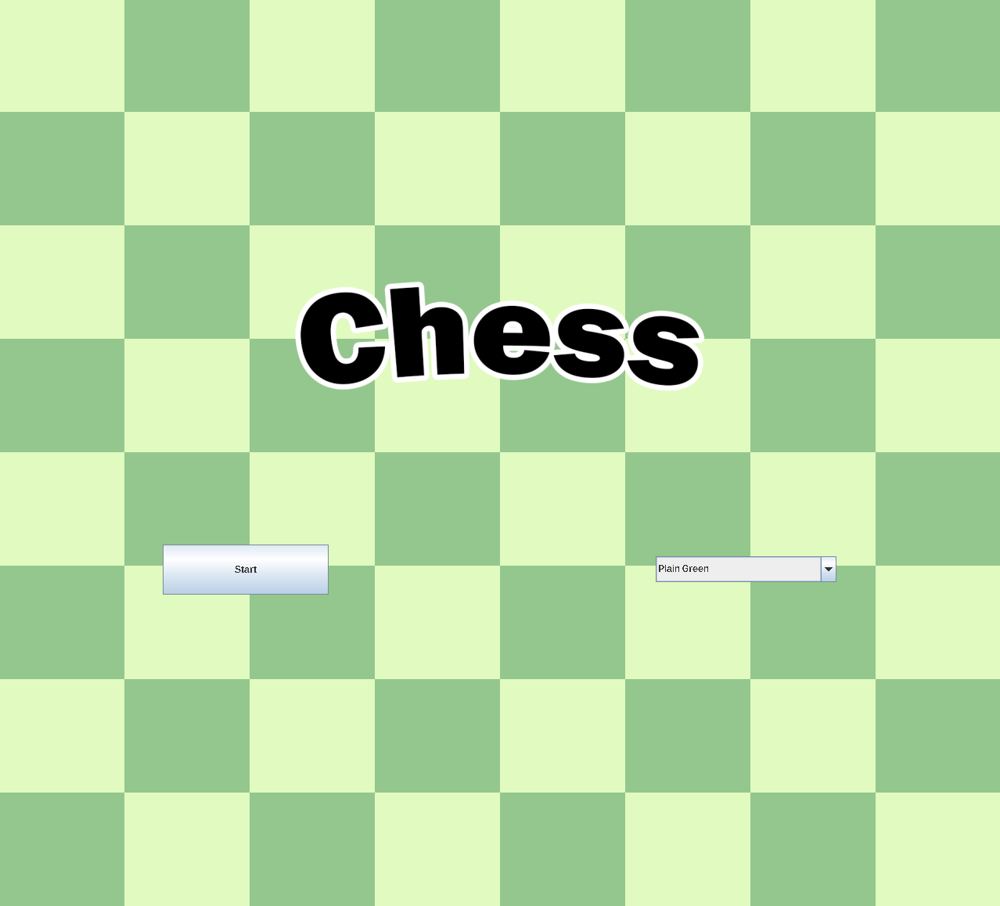
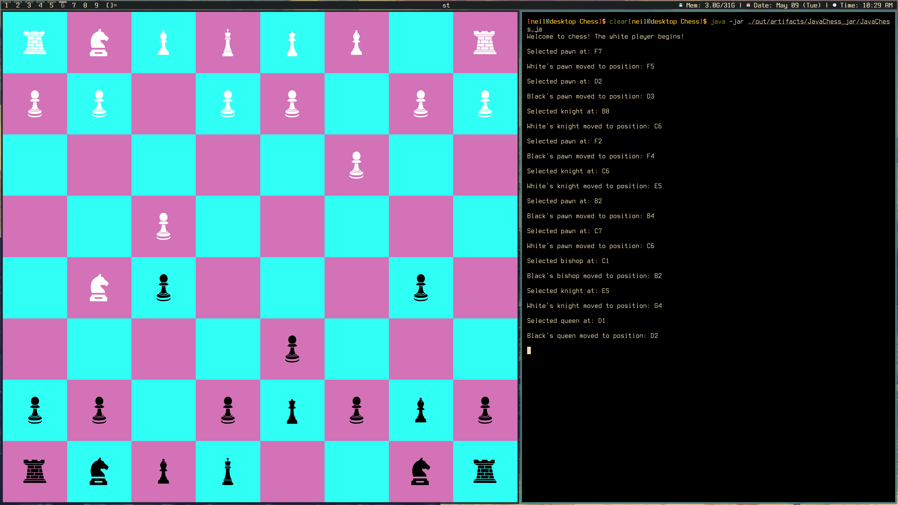

# Chess

Experience the millenium-old game of Chess 

# Installation

1. Clone the repository (git clone git@github.com:NeilKingdom/Chess.git)
2. Either double click the JAR file located in Chess/out/artifacts/JavaChess_jar, or execute
it from the command line (java -jar Chess/out/artifacts/JavaChess_jar/JavaChess.jar)

# Images

